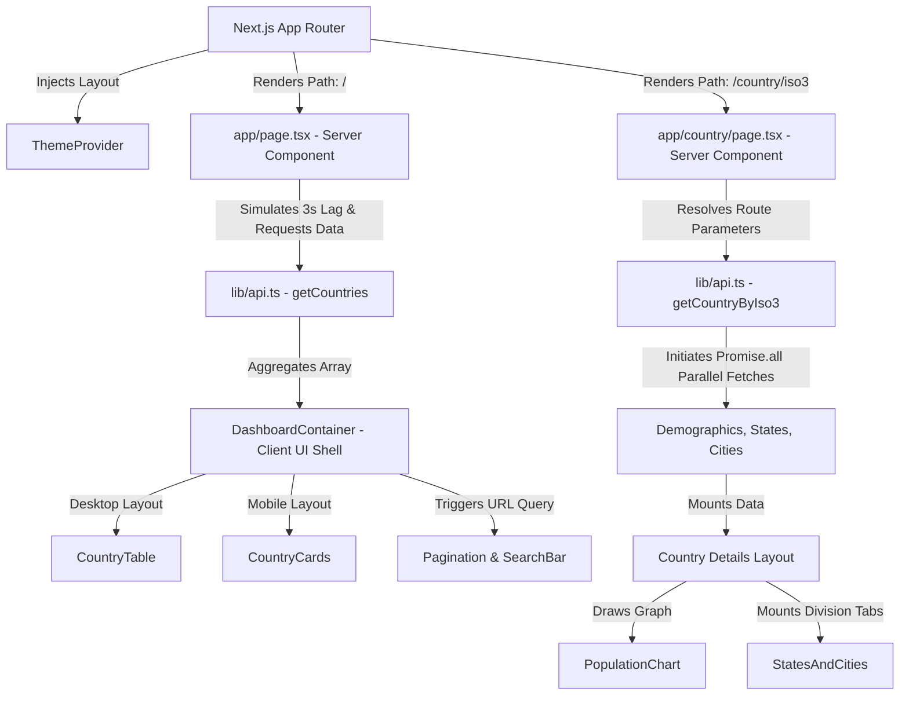

# Country Dashboard

[](https://nextjs.org/)
[](https://react.dev/)
[](https://www.typescriptlang.org/)
[](https://tailwindcss.com/)
[](https://www.docker.com/)

A country information dashboard built with Next.js, React, and TypeScript. The application allows users to browse global countries, search by name, explore detailed country profiles, visualize historical population timelines, and inspect subnational administrative divisions using the public CountriesNow API.

---

## Table of Contents

- [Overview](#overview)
- [Assignment](#assignment)
- [Highlights](#highlights)
- [Live Features](#live-features)
- [Screenshots](#screenshots)
- [Engineering Decisions](#engineering-decisions)
- [Known Limitations](#known-limitations)
- [Tech Stack](#tech-stack)
- [Project Structure](#project-structure)
- [Architecture Overview](#architecture-overview)
- [API Integration](#api-integration)
- [Installation & Setup](#installation--setup)
- [Docker Deployment](#docker-deployment)
- [Performance Optimizations](#performance-optimizations)
- [Design Decisions](#design-decisions)
- [Future Improvements](#future-improvements)

---

## Overview

This dashboard serves as a frontend interface displaying country statistics and administrative data. Users can navigate a paginated list of countries on the home dashboard, search dynamically by name, and click on any country to view its profile. The detailed profile page renders a timeline chart showing population history alongside a tabbed search list of subnational states and cities.

---

## Assignment

This project was completed as part of the Full Stack Engineering Intern take-home assignment. 

The task objectives included:
* **Modern Frontend**: Implementing a fast interface built on top of React 19 and Next.js 16.
* **Responsive UI**: Structuring a fluid, layout-adapting interface.
* **API Integration**: Aggregating and calling remote endpoints reliably.
* **Clean Architecture**: Maintaining division of concerns between Server and Client Components.
* **Docker Deployment**: Providing production-ready container builds.

---

## Highlights

* **Responsive Dashboard**: Automatically shifts between a desktop table view and touch-friendly mobile layout cards.
* **Server + Client Architecture**: Offloads initial data fetching to Server Components while keeping state interaction local.
* **TypeScript Typing**: Strict parameter and interface typings for API payloads and component props.
* **Dockerized Deployment**: Separates build steps from lightweight runtime containers via a multi-stage Dockerfile.
* **Loading Skeletons**: Displays layout placeholders during initial page loading and server-side transitions.
* **URL-Driven State**: Keeps active search keywords and page numbers synchronized in the URL query string.
* **Custom Error Handling**: Custom global error boundary controls and tailored 404 page overrides.

---

## Live Features

* **Visual Statistics Grid**: Demographics page featuring quick-glance cards showing capital cities, dialing codes, currencies, and total populations.
* **Flexible Layout Formats**: Renders `CountryTable` (a grid layout for wide screens) and switches automatically to `CountryCards` (scrollable cards list) on mobile screens.
* **URL State Synchronization**: Tracks search filters and dashboard pages using URL search parameters (`?search=...&page=...`) to allow bookmarking and history navigation.
* **Debounced Search**: Restricts name filtering queries to fire after a 300ms delay, executing searches only when inputs reach 3 or more characters.
* **Demographic Charting**: Renders historical population metrics in a Recharts Area chart, calculating overall growth percentages over the timeline.
* **Administrative Divisions Tab**: Allows users to toggle between States and Cities sub-lists inside country details. Includes a local client-side search input and custom pagination controls (24 items per page).
* **Smooth Dark Mode**: Injects theme classes using `next-themes` and a custom Tailwind variant to toggle themes without screen flickering.
* **Loading Placeholder Blocks**: Renders `TableSkeleton` for dashboard transitions and `DetailSkeleton` for dynamic route fetching.
* **Resilient Image Sourcing**: The `FlagImage` component falls back to a standardized Globe icon if flag sources are empty or image fetches fail.

---

## Screenshots

*(Placeholder sections for application screenshots)*

### Dashboard View (Desktop Table)
`[Add Dashboard Screenshot Here]`

### Country Profile & Population Chart (Desktop View)
`[Add Country Details Page Screenshot Here]`

### Mobile View (Cards Layout)
`[Add Mobile View Screenshot Here]`

### Dark Mode View
`[Add Dark Mode UI Screenshot Here]`

---

## Engineering Decisions

| Decision | Reason |
| :--- | :--- |
| **Server Components** | Fetches data on the server, accelerating initial render speeds and lowering JavaScript payload overhead. |
| **Client Components** | Handles localized interactive features (theme toggles, search inputs, tabs) on the client side only. |
| **URL-based Pagination** | Maintains shareable links, allowing browser bookmarks to preserve selected pages and active filters. |
| **Promise.all** | Dispatches requests simultaneously, cutting total HTTP load times compared to sequential calls. |
| **Centralized API Layer** | Keeps endpoints, request configurations, data parsing, and caching patterns isolated in one script file. |
| **Reusable FlagImage** | Implements standard fallbacks for broken image links or missing flag elements in one location. |
| **Loading Skeletons** | Improves perceived performance by displaying layouts before server-side transitions complete. |

---

## Known Limitations

* **API Dependency**: Data availability depends on the uptime and response speed of the public CountriesNow API.
* **Missing API Fields**: Certain countries have missing capital entries, missing dialing codes, or lack historical population data arrays. Fallback components (e.g. "N/A" text or placeholder chart blocks) handle these cases gracefully.
* **Simulated Network Lag**: An artificial delay of 3000ms is added to the main list fetch to demonstrate the loading skeleton components. This is located in [src/lib/api.ts](file:///c:/Users/adity/OneDrive/Desktop/simhatel-dahboard/src/lib/api.ts).
* **Public Flag SVGs**: Flags are loaded from third-party image sources linked in the API payload, which may occasionally experience delivery delays.

---

## Tech Stack

| Dependency | Version | Description / Purpose |
| :--- | :--- | :--- |
| **Next.js** | `16.2.9` | React framework for file-system routing, Server Components, and asset compilation. |
| **React** | `19.2.4` | Core UI engine using concurrent rendering tools like `useTransition`. |
| **TypeScript** | `5.x` | Strongly typed schema validation. |
| **Tailwind CSS** | `^4` | Utility styling framework integrated with CSS custom properties. |
| **next-themes** | `^0.4.6` | Client side styling context handling layout theme switching. |
| **Recharts** | `^3.9.0` | SVG charting library used to graph demographic timelines. |
| **Lucide React** | `^1.21.0` | Inline SVG icon system. |
| **clsx / tailwind-merge** | `^2.1.1` / `^3.6.0` | Helper libraries to resolve Tailwind layout class overrides dynamically. |

---

## Project Structure

```text
simhatel-dahboard/
├── public/                 # Static visual assets
├── src/
│   ├── app/                # Next.js App Router folders
│   │   ├── country/[iso3]/ # Country details dynamic layout
│   │   │   ├── loading.tsx # Displays profile skeleton wrapper
│   │   │   └── page.tsx    # Details loader handling parallel fetching
│   │   ├── error.tsx       # Root error boundary page
│   │   ├── globals.css     # Global styles & custom Tailwind v4 variants
│   │   ├── layout.tsx      # Root template declaring fonts and ThemeProvider
│   │   ├── loading.tsx     # Dashboard loading placeholder page
│   │   ├── not-found.tsx   # Custom 404 error page
│   │   └── page.tsx        # Dashboard Server component triggering API fetches
│   ├── components/         # Reusable presentation and UI elements
│   │   ├── BackButton.tsx  # Handles navigation updates
│   │   ├── CountryCard.tsx # Mobile representation card
│   │   ├── CountryCards.tsx# Grid container mapping mobile cards
│   │   ├── CountryRow.tsx  # Row renderer for desktop tables
│   │   ├── CountryTable.tsx# Table structure for desktop viewports
│   │   ├── DashboardContainer.tsx # Core state management for searches/pagination
│   │   ├── FlagImage.tsx   # Lazy-loaded image handler with fallbacks
│   │   ├── Header.tsx      # Application top bar and search console
│   │   ├── LoadingSkeleton.tsx # Reusable wireframe skeletal frames
│   │   ├── Pagination.tsx  # Controlled navigation paging bar
│   │   ├── PopulationChart.tsx # SVG chart plotting demographics history
│   │   ├── StatesAndCities.tsx # Tab explorer featuring divisions list search/pagination
│   │   └── ThemeToggle.tsx # Light/Dark mode toggler
│   ├── lib/
│   │   ├── api.ts          # Centralized data transport module
│   │   └── utils.ts        # String helpers for Tailwind class merges (cn)
│   ├── providers/
│   │   └── ThemeProvider.tsx # Client-side next-themes provider wrapper
│   └── types/
│       └── country.ts      # TypeScript interfaces defining Country properties
├── Dockerfile              # Multi-stage build setup file
├── package.json            # Script definitions and dependency targets
└── tsconfig.json           # Compiler rules for TypeScript
```

---

## Architecture Overview



### Component Roles

* **Server Components**: Keep layout payloads lightweight. The entry page [src/app/page.tsx](file:///c:/Users/adity/OneDrive/Desktop/simhatel-dahboard/src/app/page.tsx) and dynamic folder page [src/app/country/[iso3]/page.tsx](file:///c:/Users/adity/OneDrive/Desktop/simhatel-dahboard/src/app/country/[iso3]/page.tsx) perform data requests on the server, avoiding unnecessary client-side logic.
* **Client Components**: Used where dynamic client state is required. Interactive elements like [DashboardContainer](file:///c:/Users/adity/OneDrive/Desktop/simhatel-dahboard/src/components/DashboardContainer.tsx) handle URL routing adjustments, theme toggling, search input debounces, and Recharts graph animations.
* **API Client Layer**: Isolates fetch scripts in [src/lib/api.ts](file:///c:/Users/adity/OneDrive/Desktop/simhatel-dahboard/src/lib/api.ts). It queries backend APIs, processes data objects, maps missing data properties, and establishes cache timelines.

---

## API Integration

The project consolidates remote data endpoints hosted by **CountriesNow API** (`https://countriesnow.space/api/v0.1`).

### Unified Country Models
Instead of requiring multiple roundtrip requests in the UI, the backend method `getCountries()` combines the following endpoints into a single country model structure:
1. `GET /countries` (Retrieves country name and ISO definitions)
2. `GET /countries/flag/images` (Links flag SVG files)
3. `GET /countries/capital` (Locates capital cities)
4. `GET /countries/currency` (Returns national currency strings)
5. `GET /countries/codes` (Fetches country dialing code numbers)

### Parallel Aggregation
The client fetches independent resources using `Promise.all` inside `getCountries()` and `CountryPage`. This executes endpoints concurrently, preventing blocking rendering paths.

### HTTP Caching
Data queries use built-in fetch caching:
```javascript
const FETCH_OPTIONS = {
  next: {
    revalidate: 86400, // Caches dataset locally for 24 hours
  },
};
```
This reduces external API hits, avoids endpoint rate limits, and speeds up page reload times.

---

## Installation & Setup

### Prerequisites
Make sure you have Node.js (version 20 or higher) and npm installed.

### 1. Clone the Project
```bash
git clone <repository-url>
cd simhatel-dahboard
```

### 2. Install Package Dependencies
```bash
npm install
```

### 3. Run Development Server
```bash
npm run dev
```
Open [http://localhost:3000](http://localhost:3000) inside your web browser.

### 4. Build and Run Production Outputs
```bash
npm run build
npm run start
```

---

## Docker Deployment

The application features a production-ready `Dockerfile` structured with multi-stage build scripts to optimize image size.

### Build Image
```bash
docker build -t country-dashboard-app .
```

### Run Container
```bash
docker run -d -p 3000:3000 --name running-dashboard country-dashboard-app
```
Access the application at [http://localhost:3000](http://localhost:3000).

### Build Architecture:
* **Stage 1 (deps)**: Copies `package.json` to resolve build requirements.
* **Stage 2 (builder)**: Incorporates workspace scripts and runs `npm run build` to compile distribution outputs inside `.next`.
* **Stage 3 (runner)**: Uses a minimal Node Alpine environment (`node:22-alpine`), exports runtime environment setups (`NODE_ENV=production`), copies required folders, exposes port `3000`, and executes container startup commands (`npm start`).

---

## Performance Optimizations

* **Server-Side Fetch Caching**: Caches endpoint queries for 24 hours to prevent redundant remote requests.
* **React Transitions**: Wraps search state changes and pagination router pushes inside React's `useTransition` hook. This keeps the UI responsive during data fetches and displays skeleton elements.
* **Debounced Search Inputs**: Applies a 300ms debounce timer on input keystrokes to limit database/list filtering operations.
* **Lazy Image Loading**: Passes `loading="lazy"` attributes directly to the standard `` element in `FlagImage.tsx` to delay loading flags outside the viewport.
* **Parallel API Requests**: Resolves dynamic pages by running parallel fetch requests in `Promise.all` blocks.

---

## Design Decisions

* **URL Parameter Routing State**: Search queries and active page variables reside inside URL search parameters. This design decision makes search states and paginated grids bookmarkable and shareable.
* **Responsive Layout Differences**: Desktop screens render a clean, structured table format for dense data browsing, while mobile screens display touch-friendly grid cards.
* **Centralized API Utility**: Keeps fetch URLs, mapping scripts, and structural interfaces isolated from presentation components.
* **Tailwind v4 Variant Class Integration**: Uses custom variants (`@custom-variant dark`) in [src/app/globals.css](file:///c:/Users/adity/OneDrive/Desktop/simhatel-dahboard/src/app/globals.css) to support themes toggled by next-themes.

---

## Future Improvements

- [ ] **Favorites List**: Allow users to pin or flag countries to a favorites list stored in local storage.
- [ ] **Geographical Map Integration**: Render interactive maps (e.g. Leaflet or SVG map views) when displaying country detail statistics.
- [ ] **Advanced Dataset Filters**: Add sorting options by population size and filters to isolate countries by region/continent.
- [ ] **CSV Stats Exporter**: Add support to export historical population tables to downloadable CSV sheets.
